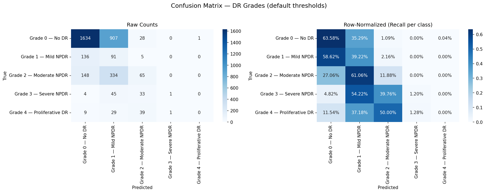
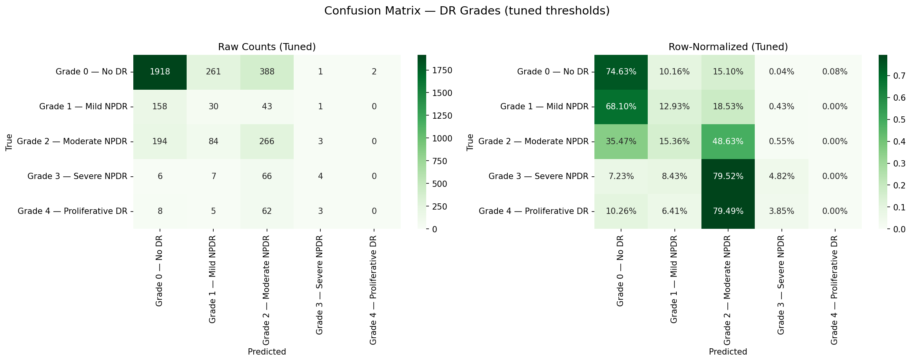
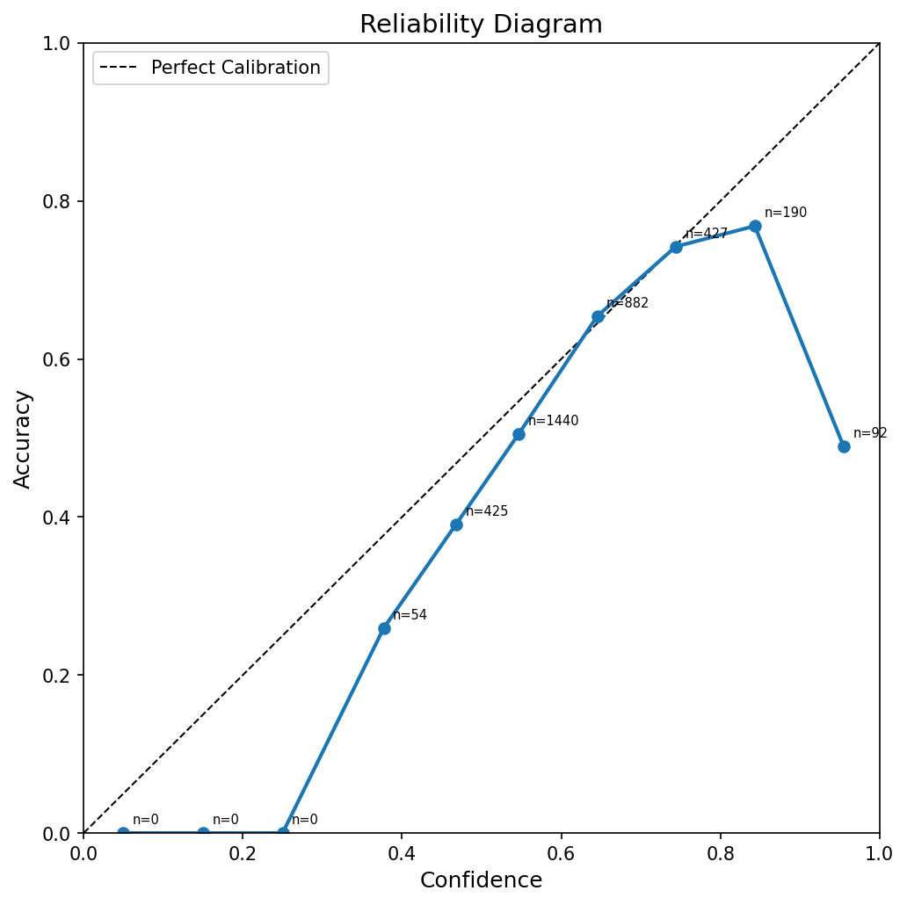

# RetinaScan — Diabetic Retinopathy Grading with CLIP-Guided Prototypes

[](https://huggingface.co/spaces/YOUR_USER/retinascan)
[](https://colab.research.google.com/drive/1RRsy4PRRXe51wuCGWgxvnXKe8kJf9n8e?usp=sharing)

RetinaScan grades diabetic retinopathy severity (Grade 0–4) using CLIP vision-language models. It works in two modes — **zero-shot** (no training, instant) or **projection-tuned** (trained, higher accuracy). The core idea is simple: instead of learning what each grade looks like from scratch, we encode clinical descriptions through CLIP's text encoder and compare them to image features.

## The Problem

> 80% of diabetic patients in low-income countries never receive retina screening due to specialist scarcity. Existing graders need thousands of labeled images per clinic.

## Results

Zero-shot CLIP alone cannot separate DR severity — the text embeddings for different grades are too close in joint space, so every image maps to "No DR" (72.62% accuracy, 0% recall on Grades 1–4). Training the projection head is required.

After 50 epochs of phased multi-task training with a balanced sampler, the model reached these numbers:

| Metric | Default Thresholds | After Threshold Tuning |
|--------|:------------------:|:----------------------:|
| Accuracy | 51.03% | **63.19%** |
| Quadratic Kappa | 0.3731 | **0.4181** |
| F1 Weighted | 0.5678 | **0.6475** |
| MAE (grade error) | 0.5912 | **0.5692** |
| Off-by-1 Accuracy | 91.37% | 80.80% |
| ECE (calibration) | 0.0468 | — |
| | **best.pt (Epoch 24)** | |

The final model (epoch 50) has similar accuracy (62.82%) but better ordinal metrics — higher kappa (0.4455), lower MAE (0.5393), and higher off-by-1 accuracy (84.30%). It makes safer mistakes by keeping predictions closer to the true grade.

| Grade | Precision | Recall | F1 | Support |
|-------|:---------:|:------:|:--:|:-------:|
| Grade 0 — No DR | 84.62% | 63.58% | 72.61% | 2570 |
| Grade 1 — Mild NPDR | 6.47% | 39.22% | 11.11% | 232 |
| Grade 2 — Moderate NPDR | 38.24% | 11.88% | 18.13% | 547 |
| Grade 3 — Severe NPDR | 50.00% | 1.20% | 2.35% | 83 |
| Grade 4 — Proliferative DR | 0.00% | 0.00% | 0.00% | 78 |

Low recall on Grades 3–4 is expected — only 83 and 78 samples respectively. The model simply never sees enough examples of these grades to learn them well. More data for minority classes would be the main lever for improvement.

### Confusion Matrices

| Default thresholds | Tuned thresholds |
|:---:|:---:|
|  |  |

### Reliability Diagram



## Impact

A mobile-deployable model that outputs Grade 0-4 severity with heatmaps, allowing non-specialists to screen patients in **under 2 seconds per image**.

## Architecture

```
CLIP Text Encoder (frozen)           CLIP Image Encoder (frozen)
         │                                    │
         ▼                                    ▼
  Severity Descriptions ──► text     retina fundus ──► image
  (Grade 0-4 clinical        features     image        features
   language)                    │                        │
                                 ▼                        ▼
                      ┌──────────────────────────────────┐
                      │     Shared Projection Head       │
                      │     (only trainable part)        │
                      └────────────┬─────────────────────┘
                                   │
                    ┌──────────────┴──────────────┐
                    ▼                              ▼
           Cosine Similarity               Ordinal Regression
           + Temperature Scaling           (CORAL head, 4 tasks)
                    │                              │
                    ▼                              ▼
           Interpretable Similarities       Clinically-grounded
           to each severity text            Grade 0-4 prediction
                    │                              │
                    └──────────┬───────────────────┘
                               ▼
                    Final Grade + Grad-CAM Heatmap
```

### Text-Derived Prototypes (Interpretability)

Instead of learning prototypes from labeled images, we encode **clinically accurate severity descriptions** through CLIP's text encoder. These text embeddings serve as fixed, interpretable anchors:

| Grade | Text Prototype |
|-------|----------------|
| 0 | "no diabetic retinopathy, healthy retina with normal blood vessels..." |
| 1 | "mild NPDR with only a few microaneurysms, no hemorrhages..." |
| 2 | "moderate NPDR with microaneurysms, dot-blot hemorrhages, hard exudates..." |
| 3 | "severe NPDR with venous beading, intraretinal hemorrhages in four quadrants..." |
| 4 | "proliferative DR with neovascularization, vitreous hemorrhage..." |

Cosine similarity against these prototypes produces interpretable confidence scores per grade — the model can explain *why* it chose a grade by showing which clinical description matched best. When uncertainty is high, it shows *which other grades* are plausible.

### Uncertainty Quantification (Clinical Trust)

A model that gives a wrong grade confidently is dangerous. RetinaScan estimates **per-image uncertainty** at inference using **test-time augmentation (TTA)**:

1. Run the input through **20 random augmentations** (flip, slight rotation, color jitter)
2. Aggregate predictions → mean grade + confidence score
3. **Confidence** = `1 - normalized predictive entropy` (0–1 scale)

**Clinical value**:
- **High confidence (≥0.7)**: grade is stable across augmentations — trust it
- **Medium confidence (0.4–0.7)**: near a decision boundary — flag for review
- **Low confidence (<0.4)**: model is uncertain — suggest retake or escalate

The app shows alternative plausible grades when confidence is low, so clinicians know *which other grades are possible*, not just that the model is unsure.

Additionally, the projection head includes **dropout layers** for **MC Dropout** support — after retraining with dropout, uncertainty estimates further improve.

### Confidence Calibration (Truthful Confidence)

A model that says "90% confident" should be right 90% of the time. RetinaScan uses **post-hoc temperature scaling** — a single learned parameter per head that scales logits to produce well-calibrated probabilities:

- **ECE (Expected Calibration Error)** measured before and after scaling
- **Ordinal temperature** scales the 4 binary logits before sigmoid
- **Prototype temperature** scales the 5-class logits before softmax
- Temperatures are optimized on the **validation set** via L-BFGS (seconds, not hours)

**Clinical value**: When the app says "85% confident — Grade 2", that 85% is truthful. A clinician can set their own threshold (e.g., "only trust predictions above 90% confidence") with known precision.

### Ordinal Regression Head (Clinical Accuracy)

Diabetic retinopathy grading is inherently **ordinal** — misclassifying Grade 3 as Grade 4 is clinically acceptable, but Grade 0 as Grade 4 is dangerous. Standard cross-entropy treats all errors equally, which is wrong for this task.

A **CORAL (COnsistent RAnk Logits)** head solves this by decomposing the problem into 4 binary tasks:
- Is severity ≥ Grade 1?
- Is severity ≥ Grade 2?
- Is severity ≥ Grade 3?
- Is severity ≥ Grade 4?

The final grade is the sum of positive tasks. This:
- Penalizes distant errors more than near errors (matches clinical reality)
- Improves **Quadratic Weighted Kappa** — the gold standard metric for DR grading
- Produces calibrated confidence scores per decision threshold

Both heads share the same learned projection features, so the interpretability of prototypes is preserved while the ordinal head drives the final prediction.

### Two Operating Modes

| Mode | Training Data | Use Case |
|------|--------------|----------|
| **Zero-Shot** | None — just CLIP text descriptions | Instant deploy, no GPU needed |
| **Projection Tuning** | Labeled retina images | Higher accuracy, trained ordinal head |

## Training Journey

The full training history — every bug, fix, calibration run, and epoch log — is documented in [journey.md](journey.md).

## Project Structure

```
RetinaScan/
├── data/raw/                      # Raw EyePACS dataset
├── data/processed/                # Preprocessed images
├── src/
│   ├── preprocess.py              # CLAHE + Ben Graham + crop-to-circle
│   ├── calibrate.py               # Post-hoc temperature scaling (ECE optimization)
│   ├── train.py                   # Training loop (CSV-based, patient-level split)
│   ├── model/
│   │   ├── clip_proto.py          # CLIP dual encoder (image + text)
│   │   └── prototype_bank.py      # Text-derived prototypes
│   ├── losses/
│   │   └── proto_loss.py          # Text-alignment + entropy + diversity loss
│   └── evaluate/
│       ├── metrics.py             # Accuracy, Kappa, F1, confusion matrix
│       └── gradcam.py             # ViT Grad-CAM severity heatmaps
├── deploy/
│   └── export_onnx.py             # ONNX export + latency benchmark
├── configs/
│   └── train_config.yaml          # All hyperparameters
├── notebooks/
│   ├── EDA.ipynb
│   ├── Train.ipynb
│   └── Evaluate.ipynb
├── app.py                         # Gradio interface (HF Spaces)
├── terminal.md                    # Colab installation guide
├── journey.md                     # Full training history and debugging log
├── requirements.txt
├── logs/                          # Confusion matrices, reliability diagrams
└── README.md
```

## Dataset

Two data sources supported (set `data.source` in config):

| Source | Size | Auth | Preprocessing |
|--------|------|------|---------------|
| `huggingface` (default) | 6.5GB — `bumbledeep/eyepacs` | None | Already cropped + resized |
| `local` | 88GB — EyePACS Kaggle | Kaggle API token | Run `src/preprocess.py` |

## Quick Start

### Pure Zero-Shot (2 minutes, no GPU needed for inference)
```bash
pip install -r requirements.txt
python src/evaluate/metrics.py --config configs/train_config.yaml
```

### With Projection Tuning (Colab T4, ~14-15h)
```bash
# Dataset loads automatically from HuggingFace — no download step needed
python src/train.py --config configs/train_config.yaml
python src/calibrate.py --config configs/train_config.yaml --checkpoint checkpoints/best.pt
python src/evaluate/metrics.py --config configs/train_config.yaml --checkpoint checkpoints/best.pt
```

### Grad-CAM Visualization
```bash
python src/evaluate/gradcam.py --config configs/train_config.yaml --checkpoint checkpoints/best.pt --image sample.jpeg
```

## Deployment

1. **Train** → `checkpoints/best.pt`
2. **Push to Hugging Face Spaces** (Gradio SDK — `app.py`)
3. **UptimeRobot** ping every 5 min → keeps Space warm
4. **Inference**: <500ms per image on CPU, <100ms on GPU

## Citation

```bibtex
@misc{retinascan2026,
  title={RetinaScan: Diabetic Retinopathy Grading via CLIP Text-Guided Visual Prototypes},
  author={Simanta Das},
  year={2026}
}
```
