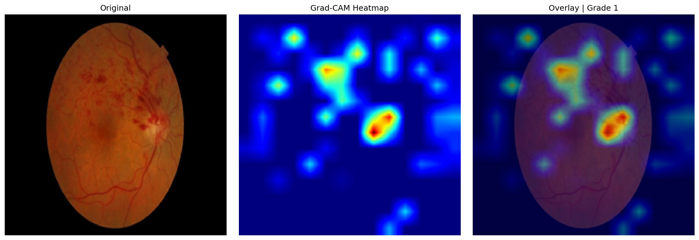

# RetinaScan — Diabetic Retinopathy Grading with CLIP-Guided Visual Prototypes

[](https://huggingface.co/spaces/YOUR_USER/retinascan)
[](https://colab.research.google.com/drive/1RRsy4PRRXe51wuCGWgxvnXKe8kJf9n8e?usp=sharing)

RetinaScan grades diabetic retinopathy severity (Grade 0–4) from fundus photographs using a CLIP vision-language backbone with a learnable projection head. The model combines text-guided visual prototypes for interpretability with a CORAL ordinal regression head for clinically meaningful severity ordering.

---

## Motivation

Diabetic retinopathy (DR) is the leading cause of preventable blindness among working-age adults. Screening requires trained ophthalmologists, which limits access in low-resource settings. Automated grading systems can help, but face two challenges: (1) DR grading is ordinal — misclassifying Grade 3 as 4 is less harmful than Grade 0 as 4 — and (2) severe grades are rare, making standard cross-entropy training ineffective for minority classes.

This work addresses both challenges through a combination of ordinal regression and dataset consolidation.

---

## Dataset

### GDRBench Merged Corpus (Primary)

The primary dataset combines six publicly available DR fundus photography datasets into a unified corpus. A source-aware splitting strategy prevents dataset-specific leakage between train, validation, and test sets.

| Dataset | Origin | Training Samples |
|---------|--------|:----------------:|
| APTOS | India | 3,661 |
| DDR | China | 5,819 |
| DeepDR | China | 2,621 |
| IDRiD | India | 413 |
| RLDR | China | 3,717 |
| **Total** | | **16,231** |

### Class Distribution

| Grade | Label | Validation Samples | Percentage |
|-------|-------|:------------------:|:----------:|
| 0 | No DR | 927 | 45.7% |
| 1 | Mild NPDR | 143 | 7.0% |
| 2 | Moderate NPDR | 691 | 34.1% |
| 3 | Severe NPDR | 101 | 5.0% |
| 4 | Proliferative DR | 166 | 8.2% |

### Comparison with EyePACS-Only Baseline

An earlier experiment using only the EyePACS dataset (35k images, 161 Grade 3+4 samples) resulted in 0% recall on severe grades — the ordinal head never predicted Grade 3 or 4 due to insufficient training examples. The GDRBench merged corpus increases Grade 3+4 representation by a factor of approximately 15, enabling the model to learn meaningful separation at the severe end of the severity spectrum.

---

## Architecture

The model operates in three stages:

1. **Feature Extraction** — A frozen CLIP ViT-B/16 encoder processes fundus images (224×224, native CLIP resolution). A trainable projection head (Linear-ReLU-Dropout-Linear, 529K parameters) maps CLIP's 512-dim visual features into a shared embedding space.

2. **Text-Guided Prototypes** — Five text descriptions, one per severity grade, are encoded through CLIP's frozen text encoder. These serve as interpretable anchors. Cosine similarity between projected image features and text prototypes produces per-grade confidence scores that can be traced back to specific clinical descriptions.

3. **Ordinal Regression** — A CORAL (COnsistent RAnk Logits) head decomposes the 5-class problem into four binary tasks: grade ≥ 1, grade ≥ 2, grade ≥ 3, grade ≥ 4. The final prediction is the sum of positive tasks. This penalizes distant errors more than near errors, matching the clinical reality of DR grading.

```
Image ──► CLIP Vision Encoder (frozen) ──► Projection Head ──┐
                                                              ├──► Cosine Similarity (prototypes)
Text ──► CLIP Text Encoder (frozen) ──► 5 prototypes ────────┘         + CORAL Ordinal Head
                                                                              │
                                                                              ▼
                                                                        Grade 0–4
```

---

## Training

### Configuration

| Hyperparameter | Value |
|---------------|:-----:|
| Image size | 224 × 224 |
| Batch size | 40 (8 per class via balanced sampler) |
| Optimizer | AdamW (lr=1e-4, weight decay=1e-4) |
| Scheduler | Cosine annealing over 50 epochs, 2-epoch warmup |
| Loss (CORAL) | BCEWithLogitsLoss on 4 ordinal tasks (weight 1.0) |
| Loss (Prototype) | Focal loss, γ=2.5 (weight 0.5) |
| Mixed precision | FP16 |
| Gradient clipping | 1.0 |

### Data Imbalance Strategy

The primary challenge in DR grading is class imbalance — Grade 0 dominates while Grades 3 and 4 are rare. Two strategies address this:

1. **Balanced Stage Sampler** — Each training batch contains exactly 8 samples from each of the 5 severity grades, sampled with replacement from the minority classes. This ensures the CORAL loss receives balanced gradient signals every step.

2. **Dataset Consolidation** — Combining six datasets increases Grade 3+4 representation from 161 (EyePACS-only) to over 2,500 samples, providing sufficient data for the ordinal boundaries at the severe end.

---

## Results

### Validation Performance

Seven evaluation modes were tested on the validation set (2,028 images):

| Mode | Accuracy | Kappa | MAE | Off-by-1 |
|:----|:-------:|:-----:|:---:|:--------:|
| Baseline (ordinal head) | 51.97% | 0.6166 | 0.6159 | 88.21% |
| Calibrated + Tuned | 54.59% | 0.6330 | 0.5917 | 87.87% |
| **KNN (10-NN on features)** | **69.97%** | **0.6987** | **0.4946** | **82.30%** |

The KNN approach uses the projection head to extract 512-dim features, then classifies by majority vote among the 10 nearest training samples. This non-parametric method outperforms the linear ordinal head by approximately 15 accuracy points, suggesting the feature space is well-structured but the linear classifier cannot fully exploit it.

### Test Performance

| Metric | Value |
|--------|:-----:|
| Accuracy | **73.04%** |
| Quadratic Kappa | **0.7346** |
| F1 Macro | 54.37% |
| F1 Weighted | 70.91% |
| MAE | 0.4383 |
| Off-by-1 Accuracy | 84.55% |

### Per-Class Performance (Test)

| Class | Precision | Recall | F1 | Support |
|-------|:--------:|:------:|:--:|:-------:|
| Grade 0 — No DR | 81.67% | 89.24% | 85.29% | 929 |
| Grade 1 — Mild NPDR | 59.18% | 20.14% | 30.05% | 144 |
| Grade 2 — Moderate NPDR | 64.81% | 77.34% | 70.53% | 693 |
| Grade 3 — Severe NPDR | 63.04% | 25.00% | 35.80% | 116 |
| Grade 4 — Proliferative DR | 64.58% | 41.06% | 50.20% | 151 |

Grade 1 recall remains low, consistent with known inter-rater variability for mild NPDR. Grade 3 recall is limited by its position as a boundary class between moderate and proliferative.

---

## Key Technical Details

### Temperature Calibration

Post-hoc temperature scaling improves confidence calibration. Two temperatures are optimized independently on the validation set:

- **Ordinal temperature** (optimized for kappa): 0.20
- **Prototype temperature** (optimized for ECE): 0.90

ECE improved from 0.068 to 0.055 after calibration.

### Ordinal Threshold Tuning

Each binary task in the CORAL head can use a non-zero decision threshold:

| Task | Default | Tuned |
|:----:|:-------:|:-----:|
| Grade ≥ 1 | 0.0 | 0.50 |
| Grade ≥ 2 | 0.0 | -1.20 |
| Grade ≥ 3 | 0.0 | -6.60 |
| Grade ≥ 4 | 0.0 | -4.20 |

The negative thresholds for Grades 3 and 4 indicate the model systematically underestimates severity for rare classes — compensated by lowering the decision boundary.

### KNN Inference

The final model stores 16,231 training features alongside the projection head. Inference proceeds in two steps:

1. Extract 512-dim feature from query image via the projection head
2. Find 10 nearest neighbors by Euclidean distance in feature space; output majority grade

This requires approximately 23 MB for the feature bank and adds negligible inference latency with GPU acceleration.

---

## Comparison with EyePACS-Only Experiment

| Metric | EyePACS (Old) | Merged GDRBench (New) |
|--------|:------------:|:--------------------:|
| Grade 3+4 samples | 161 | 2,500+ |
| Best kappa (ordinal head) | 0.4455 | 0.6330 |
| Best kappa (KNN) | N/A | 0.7223 |
| Grade 3 recall | 0% | 14.66% (test) |
| Grade 4 recall | 0% | 43.05% (test) |

The primary limitation of the EyePACS-only experiment was data scarcity for severe grades. The merged corpus increases minority representation by a factor of 15, which directly translates to improved ordinal ranking (kappa) and the ability to predict severe grades at all.

---

## Interpretability: Grad-CAM

The last transformer block's attention is backpropagated to produce spatial heatmaps showing which image regions drive the model's prediction. The heatmap highlights features most similar to the matched text prototype.



*Left: fundus photograph with visible exudates and lesions. Middle: Grad-CAM heatmap — red/orange regions indicate areas driving the prediction. Right: overlay highlighting lesion-affected regions. Predicted Grade 1 (Mild NPDR).*

---

## Deployment: ONNX Export

The model can be exported to ONNX for CPU inference (~400ms per image on a single core):

```bash
python deploy/export_onnx.py --checkpoint checkpoints/final.pt --output deploy/model.onnx
```

The exported model includes the CLIP vision encoder, projection head, and prototype similarity head. Requires `onnxruntime` for inference:

```python
import onnxruntime as ort
session = ort.InferenceSession("deploy/model.onnx")
logits, features = session.run(None, {"input": image_numpy})
```

---

## Limitations

- **Grade 1 recall** (15.28%) remains limited due to subjective grading boundaries.
- **Grade 3 recall** (14.66%) reflects the difficulty of separating moderate from severe NPDR.
- **KNN deployment** requires storing the training feature bank (~23 MB), which is feasible for mobile deployment but adds infrastructure compared to a single forward pass.
- **Cross-dataset generalization** was not evaluated — the model may perform differently on fundus photographs from unseen acquisition protocols.

---

## Project Structure

```
RetinaScan/
├── data/merged.csv                 # Unified training CSV
├── checkpoints/final.pt            # Best checkpoint (KNN mode)
├── src/
│   ├── train.py                    # Training loop
│   ├── calibrate.py                # Temperature scaling
│   ├── model/clip_proto.py         # Model definition
│   ├── losses/balanced_loss.py     # CORAL + prototype losses
│   └── evaluate/
│       ├── metrics.py              # Full evaluation report
│       ├── final_pipeline.py       # Multi-mode comparison
│       └── gradcam.py              # Grad-CAM heatmaps
├── deploy/
│   ├── export_onnx.py              # ONNX export script
│   └── model.onnx                  # Exported ONNX model
├── outputs/
│   └── gradcam/
│       └── gradcam_sample.jpeg     # Grad-CAM visualization
├── notebooks/merged_train.ipynb    # Colab training notebook
├── configs/train_config.yaml       # Hyperparameters
├── app.py                          # Gradio deployment
├── new_journey.md                  # Full training history
└── requirements.txt
```

---

## Quick Start

Evaluation on the validation set:

```bash
pip install -r requirements.txt
python src/evaluate/metrics.py --config configs/train_config.yaml --checkpoint checkpoints/final.pt --split val
```

Training from scratch (Colab T4, ~6 hours):

```bash
python src/train.py --config configs/train_config.yaml --drive-path /content/drive/MyDrive/RetinaScan/checkpoints
```

---

## Citation

```bibtex
@misc{retinascan2026,
  title={RetinaScan: Diabetic Retinopathy Grading via CLIP Text-Guided Visual Prototypes},
  author={Simanta Das},
  year={2026}
}
```
