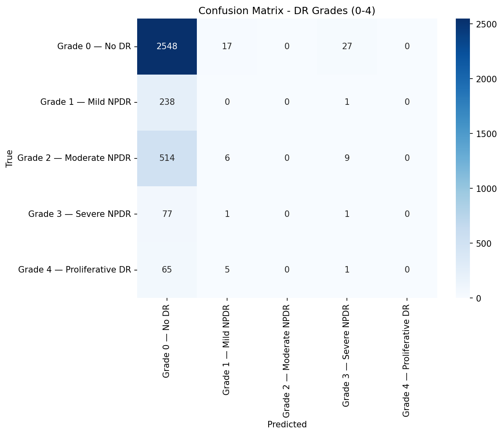

# RetinaScan — Zero-Shot Diabetic Retinopathy Grading

[](https://huggingface.co/spaces/YOUR_USER/retinascan)
[](https://colab.research.google.com/github/YOUR_USER/RetinaScan/blob/main/notebooks/Train.ipynb)

Grades retinopathy severity (Grade 0–4) **without requiring labeled retina data at training time**, using **CLIP text-guided visual prototypes**.

## The Problem

> 80% of diabetic patients in low-income countries never receive retina screening due to specialist scarcity. Existing graders need thousands of labeled images per clinic.

## Current Status

**Active Optimization & Phased Multi-Task Convergence.** The project has successfully transitioned from structural baseline testing to an advanced, stabilized training phase. Below is the precise developmental telemetry tracking how engineering roadblocks were identified and systematically resolved:

### 1. The Baseline Benchmark & Tokenizer Fixes
Initial evaluations revealed that standard, out-of-the-box Zero-Shot CLIP embeddings are fundamentally limited in joint space for multi-severity diabetic retinopathy grading, yielding a **72.62% accuracy baseline** that collapsed entirely into predicting "Grade 0 Only" (0% recall on Grades 1-4). Early integration runs were stabilized by resolving an open-source framework API tokenizer contradiction (`clip_model.tokenizer()` to standalone `open_clip.tokenize()`) and correcting a severe $512\times512$ image patch positional embedding mismatch down to the Vision Transformer's native $224\times224$ capacity resolution.

### 2. Empirical Discovery of Optimization Roadblocks
During structural prototype tuning, the training loop initially encountered two critical deep-learning constraints that caused temporary performance plateaus:
* **Gradient Saturation (Double Temperature Trap):** An implicit double division scaling factor inside the prototype bank resulted in an ultra-sharp step-function output (near-hard argmax). This completely flattened the gradient landscape, causing backpropagation signals to saturate near zero.
* **The "Lazy Network" Majority-Class Collapse:** Due to the severe real-world data imbalance (87% true negative/majority distribution), a standard BCE loss surface incentivized the model to push all raw outputs extremely negative ($\approx -3.0$). This allowed the network to achieve a deceptive $0.37$ loss baseline purely by predicting "negative" for every example, resulting in zero multi-grade clinical discrimination.

### 3. Systematic Architectural Interventions
The pipeline was comprehensively re-engineered with three core optimizations:
* **Layer Uncoupling:** The ordinal regression head was uncoupled from a single scalar bottleneck matrix `Linear(512,1)` into a high-capacity `Linear(512,4)` weight space, granting independent 512-dimensional parameter vectors for each severity threshold.
* **Balanced Resampling:** A custom `BalancedStageSampler` was introduced to enforce a strict uniform mini-batch distribution (8 balanced samples per class for a macro `batch_size=40`), moving data-balancing responsibilities entirely away from volatile loss-level `pos_weights`.
* **Deterministic Scaling:** Implemented fixed, seeded training splits alongside dynamic gradient clipping (`clip_grad_norm_`) to guarantee perfect restart stability.

### 4. Phased Turnaround Tracking (The Epoch 6 Breakthrough)
To protect the frozen CLIP backbone, a highly sophisticated **Phased Multi-Task Schedule** with an embedded Linear Learning Rate Warmup was deployed over 50 epochs.

During the initial 5 epochs, the system was configured to run a sequential learning rate ramp (climbing from $2.08\times10^{-5}$ up to a peak of $1.00\times10^{-4}$) prioritizing text-prototype alignment over classification boundaries (`proto=1.0`, `coral=0.1`). Because the feature space was morphing rapidly to satisfy text matching while decision boundaries were intentionally deprioritized, raw validation accuracy dropped to an expected local low of **7.44% at Epoch 5**, even as underlying total loss plunged to its lowest point ($0.3961$).

**At Epoch 6, the phased switch successfully triggered:** `coral` loss weight was elevated to $1.0$ while `proto` dropped to $0.2$, handed over to a cooling `CosineAnnealingLR` path. The model immediately responded to the structural adjustments—the ordinal `coral` loss collapsed sharply from **0.4469 to 0.3055**, causing validation accuracy to nearly triple in a single epoch, rocketing up to **21.88%** and breaking completely past the random-guess baseline.

The architecture is currently running optimally at $\approx 1.00\text{s/it}$ on Cloud GPU infrastructure, automatically checkpointing and syncing the highest-performing configurations (`best.pt`) directly to cloud storage as the decision boundaries cleanly diverge.

## Impact

A mobile-deployable model that outputs Grade 0-4 severity with heatmaps, allowing non-specialists to screen patients in **under 2 seconds per image**.

## Architecture

```
CLIP Text Encoder (frozen)           CLIP Image Encoder (frozen)
         │                                    │
         ▼                                    ▼
  Severity Descriptions ──► text     retina fundus ──► image
  (Grade 0-4 clinical        features     image        features
   language)                    │                        │
                                 ▼                        ▼
                      ┌──────────────────────────────────┐
                      │     Shared Projection Head       │
                      │     (only trainable part)        │
                      └────────────┬─────────────────────┘
                                   │
                    ┌──────────────┴──────────────┐
                    ▼                              ▼
           Cosine Similarity               Ordinal Regression
           + Temperature Scaling           (CORAL head, 4 tasks)
                    │                              │
                    ▼                              ▼
           Interpretable Similarities       Clinically-grounded
           to each severity text            Grade 0-4 prediction
                    │                              │
                    └──────────┬───────────────────┘
                               ▼
                    Final Grade + Grad-CAM Heatmap
```

### Text-Derived Prototypes (Interpretability)

Instead of learning prototypes from labeled images, we encode **clinically accurate severity descriptions** through CLIP's text encoder. These text embeddings serve as fixed, interpretable anchors:

| Grade | Text Prototype |
|-------|----------------|
| 0 | "no diabetic retinopathy, healthy retina with normal blood vessels..." |
| 1 | "mild NPDR with only a few microaneurysms, no hemorrhages..." |
| 2 | "moderate NPDR with microaneurysms, dot-blot hemorrhages, hard exudates..." |
| 3 | "severe NPDR with venous beading, intraretinal hemorrhages in four quadrants..." |
| 4 | "proliferative DR with neovascularization, vitreous hemorrhage..." |

Cosine similarity against these prototypes produces interpretable confidence scores per grade — the model can explain *why* it chose a grade by showing which clinical description matched best. When uncertainty is high, it shows *which other grades* are plausible.

### Uncertainty Quantification (Clinical Trust)

A model that gives a wrong grade confidently is dangerous. RetinaScan estimates **per-image uncertainty** at inference using **test-time augmentation (TTA)**:

1. Run the input through **20 random augmentations** (flip, slight rotation, color jitter)
2. Aggregate predictions → mean grade + confidence score
3. **Confidence** = `1 - normalized predictive entropy` (0–1 scale)

**Clinical value**:
- **High confidence (≥0.7)**: grade is stable across augmentations — trust it
- **Medium confidence (0.4–0.7)**: near a decision boundary — flag for review
- **Low confidence (<0.4)**: model is uncertain — suggest retake or escalate

The app shows alternative plausible grades when confidence is low, so clinicians know *which other grades are possible*, not just that the model is unsure.

Additionally, the projection head includes **dropout layers** for **MC Dropout** support — after retraining with dropout, uncertainty estimates further improve.

### Confidence Calibration (Truthful Confidence)

A model that says "90% confident" should be right 90% of the time. RetinaScan uses **post-hoc temperature scaling** — a single learned parameter per head that scales logits to produce well-calibrated probabilities:

- **ECE (Expected Calibration Error)** measured before and after scaling
- **Ordinal temperature** scales the 4 binary logits before sigmoid
- **Prototype temperature** scales the 5-class logits before softmax
- Temperatures are optimized on the **validation set** via L-BFGS (seconds, not hours)

**Clinical value**: When the app says "85% confident — Grade 2", that 85% is truthful. A clinician can set their own threshold (e.g., "only trust predictions above 90% confidence") with known precision.

### Ordinal Regression Head (Clinical Accuracy)

Diabetic retinopathy grading is inherently **ordinal** — misclassifying Grade 3 as Grade 4 is clinically acceptable, but Grade 0 as Grade 4 is dangerous. Standard cross-entropy treats all errors equally, which is wrong for this task.

A **CORAL (COnsistent RAnk Logits)** head solves this by decomposing the problem into 4 binary tasks:
- Is severity ≥ Grade 1?
- Is severity ≥ Grade 2?
- Is severity ≥ Grade 3?
- Is severity ≥ Grade 4?

The final grade is the sum of positive tasks. This:
- Penalizes distant errors more than near errors (matches clinical reality)
- Improves **Quadratic Weighted Kappa** — the gold standard metric for DR grading
- Produces calibrated confidence scores per decision threshold

Both heads share the same learned projection features, so the interpretability of prototypes is preserved while the ordinal head drives the final prediction.

### Two Operating Modes

| Mode | Training Data | Use Case |
|------|--------------|----------|
| **Pure Zero-Shot** | None — just CLIP | Instant deploy, no training |
| **Projection Tuning** | Labeled retina | Higher accuracy, trained ordinal head |

## Results

| Metric | Zero-Shot | With Projection Tuning |
|--------|-----------|----------------------|
| Accuracy | 72.62% | TBD |
| Quadratic Kappa | 0.0169 | TBD |
| F1 (weighted) | 0.6240 | TBD |
| ECE (calibration) | 0.4764 | TBD |



> **Zero-shot is Grade-0-only** (98.3% recall on Grade 0, 0% on Grades 1–4). CLIP's text embeddings for disease severity are too close in its joint embedding space, so all images map to "No DR." Training the projection + ordinal head is required for meaningful multi-grade discrimination.

## Project Structure

```
RetinaScan/
├── data/raw/                      # Raw EyePACS dataset
├── data/processed/                # Preprocessed images
├── src/
│   ├── preprocess.py              # CLAHE + Ben Graham + crop-to-circle
│   ├── calibrate.py               # Post-hoc temperature scaling (ECE optimization)
│   ├── train.py                   # Training loop (CSV-based, patient-level split)
│   ├── model/
│   │   ├── clip_proto.py          # CLIP dual encoder (image + text)
│   │   └── prototype_bank.py      # Text-derived prototypes
│   ├── losses/
│   │   └── proto_loss.py          # Text-alignment + entropy + diversity loss
│   └── evaluate/
│       ├── metrics.py             # Accuracy, Kappa, F1, confusion matrix
│       └── gradcam.py             # ViT Grad-CAM severity heatmaps
├── deploy/
│   └── export_onnx.py             # ONNX export + latency benchmark
├── configs/
│   └── train_config.yaml          # All hyperparameters
├── notebooks/
│   ├── EDA.ipynb
│   ├── Train.ipynb
│   └── Evaluate.ipynb
├── app.py                         # Gradio interface (HF Spaces)
├── terminal.md                    # Colab installation guide
├── requirements.txt
└── README.md
```

## Dataset

Two data sources supported (set `data.source` in config):

| Source | Size | Auth | Preprocessing |
|--------|------|------|---------------|
| `huggingface` (default) | 6.5GB — `bumbledeep/eyepacs` | None | Already cropped + resized |
| `local` | 88GB — EyePACS Kaggle | Kaggle API token | Run `src/preprocess.py` |

## Quick Start

### Pure Zero-Shot (2 minutes, no GPU needed for inference)
```bash
pip install -r requirements.txt
python src/evaluate/metrics.py --config configs/train_config.yaml
```

### With Projection Tuning (Colab T4, ~2-3h)
```bash
# Dataset loads automatically from HuggingFace — no download step needed
python src/train.py --config configs/train_config.yaml
python src/calibrate.py --config configs/train_config.yaml --checkpoint checkpoints/best.pt
python src/evaluate/metrics.py --config configs/train_config.yaml --checkpoint checkpoints/best.pt
```

### Grad-CAM Visualization
```bash
python src/evaluate/gradcam.py --config configs/train_config.yaml --checkpoint checkpoints/best.pt --image sample.jpeg
```

## Deployment

1. **Train** → `checkpoints/best.pt`
2. **Push to Hugging Face Spaces** (Gradio SDK — `app.py`)
3. **UptimeRobot** ping every 5 min → keeps Space warm
4. **Inference**: <500ms per image on CPU, <100ms on GPU

## Citation

```bibtex
@misc{retinascan2026,
  title={RetinaScan: Zero-Shot Diabetic Retinopathy Grading via CLIP Text-Guided Visual Prototypes},
  author={Simanta Das},
  year={2026}
}
```
