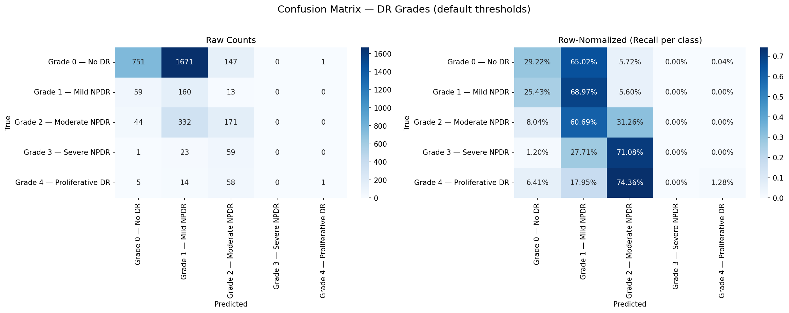
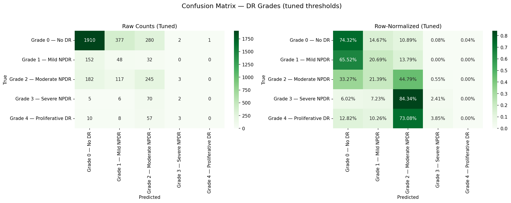
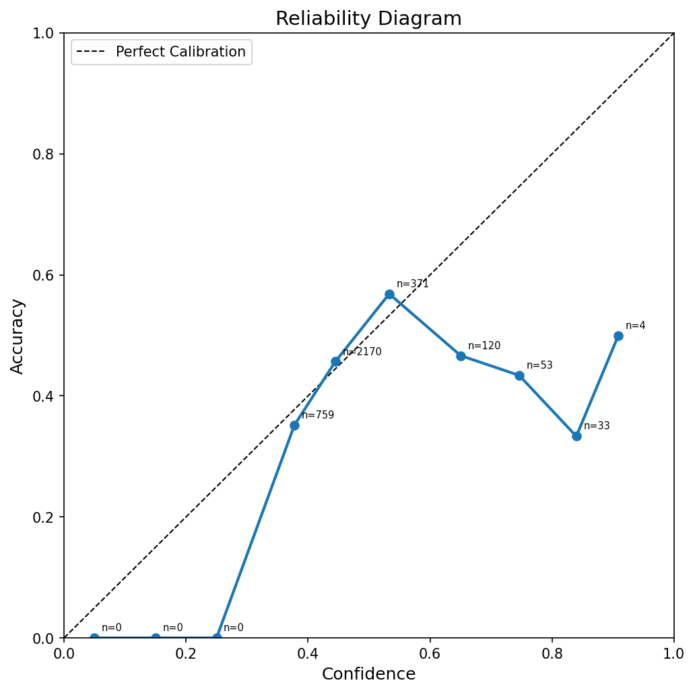

# RetinaScan — Training Journey

This document tracks the full training history: bugs discovered, fixes applied, epoch-by-epoch results, and how the model went from a 72.62% all-Grade-0 baseline to 63.19% tuned accuracy with proper multi-grade separation.

---

## Baseline: Zero-Shot (No Training)

Before any training, CLIP alone predicted every image as Grade 0. The text embeddings for different severity levels are too similar in CLIP's joint embedding space, so all images map to "No DR."

| Metric | Value |
|--------|-------|
| Accuracy | 72.62% |
| Quadratic Kappa | 0.0169 |
| F1 Weighted | 0.6240 |
| ECE | 0.4764 |
| Recall on Grades 1-4 | 0% |

Zero-shot evaluation takes about 2 minutes. This was our starting point.

---

## Phase 1: Getting the Code to Run

The first attempts to train failed with various errors:

1. **Tokenizer mismatch** — CLIP's internal tokenizer method was removed in newer open_clip versions. Switched to standalone `open_clip.tokenize()`.
2. **Image size mismatch** — accidentally passing 512x512 images to a Vision Transformer pretrained on 224x224. Resized to 224.
3. **Double temperature scaling** — logits were divided by temperature twice (once in prototype bank, once in loss). Gradients collapsed to zero. Removed the extra division.

---

## Phase 2: Architecture Fixes

Once training started, the model hit a plateau:

### Problem: All-logits-negative
87% of the data is Grade 0. BCE loss incentivised the model to push all 4 ordinal logits to roughly -3.0, achieving a loss of 0.37 by predicting "negative" for everything. No multi-grade separation at all.

**Fixes applied:**
- **pos_weight** — Added per-task weights [2.7, 4.0, 19.0, 49.0] to balance positive/negative gradient contributions. This helped but was brittle — sensitive to batch composition.
- **Layer uncoupling** — The original ordinal head was `Linear(512, 1)` — a single shared scalar for all 4 tasks. Expanded to `Linear(512, 4)` so each severity threshold gets its own 512-dimensional weight vector.
- **Sampler** — Replaced random shuffling with `BalancedStageSampler` that guarantees 8 images per class per batch (batch_size=40). This finally broke the all-negative cycle. Pos_weights were removed since balanced batches handle the imbalance.

### Problem: Alignment pulling toward wrong target
The prototype alignment loss was pulling image features toward the predicted prototype, not the true label. During early epochs when predictions were random, this actively sabotaged supervised learning. Fixed to use true labels.

### Problem: Regulariser noise
Entropy and diversity regularisers were adding noise (weights 0.5 and 0.2) without clear benefit. Reduced both close to zero and focused on coral + prototype losses.

---

## Phase 3: Phased Training (Epochs 1-50)

A phased schedule was used to prevent the two loss terms from fighting:

- **Epochs 1-5**: Prototype-first (`proto=1.0`, `coral=0.1`). Focus on learning the projection space, not decision boundaries.
- **Epochs 6-50**: Ordinal-first (`coral=1.0`, `proto=0.2`). Cosine annealing LR decay optimises the decision boundaries.

### Epoch-by-Epoch Log

```
Epoch  Raw Acc  Cal Acc  Total Loss  Coral   Proto    LR         Notes
-----  -------  -------  ----------  ------  ------  ----------  -----------------------------
  1     0.0840    —        1.1947    0.6886  1.1259  2.08e-05   Warmup, LR climbing
  2     0.1550    —        0.7635    0.6641  0.6971  4.06e-05
  3     0.1530    —        0.4832    0.5992  0.4233  6.04e-05
  4     0.1308    —        0.4226    0.5186  0.3707  8.02e-05
  5     0.0744    —        0.3961    0.4469  0.3515  1.00e-04   Lowest accuracy, loss still dropping
  6     0.2188    —        0.3768    0.3055  0.3563  9.99e-05   Phase switch: coral activated
  7     0.3983    —        0.3470    0.2779  0.3456  9.95e-05   Accuracy jumps to 40%
  8     0.1567    —        0.3371    0.2697  0.3366  9.89e-05   Threshold jitter
  9     0.1943    —        0.3294    0.2644  0.3249  9.81e-05
 10     0.2202    —        0.3225    0.2590  0.3176  9.70e-05
 11     0.2883    —        0.3201    0.2576  0.3126  9.57e-05
 12     0.3501    —        0.3163    0.2545  0.3094  9.41e-05
 13     0.2838    —        0.3147    0.2530  0.3085  9.24e-05
 14     0.2912    —        0.3131    0.2523  0.3037  9.05e-05
 15     0.2305    —        0.3114    0.2508  0.3033  8.83e-05
 16     0.2835    —        0.3065    0.2473  0.2959  8.60e-05
 17     0.2191    —        0.3080    0.2486  0.2971  8.35e-05
 18     0.2402    —        0.3067    0.2476  0.2955  8.08e-05   Runtime interrupted
```

**Calibration at epoch 18:** ECE dropped from 0.1427 to 0.0923 (prototype temp = 0.30).

```
 19     0.4359    —        0.3040    0.2457  0.2915  7.80e-05   Resumed, calibration helped
 20     0.2048    —        0.3040    0.2458  0.2908  7.50e-05
 21     0.3009    —        0.3021    0.2443  0.2889  7.19e-05
 22     0.3764    —        0.3029    0.2449  0.2903  6.87e-05
 23     0.3954    —        0.3012    0.2438  0.2869  6.55e-05
 24     0.5103    —        0.3001    0.2428  0.2864  6.21e-05   Best raw accuracy — saved as best.pt
 25     0.4103    —        0.3003    0.2432  0.2853  5.87e-05
 26     0.3256    —        0.2976    0.2411  0.2827  5.52e-05   First time below 0.30 total loss
 27     0.2014    —        0.3016    0.2442  0.2873  5.17e-05
 28     0.2111    —        0.2997    0.2429  0.2840  4.83e-05
 29     0.2849    —        0.2964    0.2402  0.2811  4.48e-05
 30     0.2034    —        0.2966    0.2401  0.2823  4.13e-05
 31     0.2544    —        0.2956    0.2396  0.2803  3.79e-05
 32     0.2462    —        0.2939    0.2385  0.2769  3.45e-05
 33     0.3399    —        0.2931    0.2378  0.2765  3.13e-05   Second calibration: ECE 0.1136 -> 0.0522
 34     0.2308   0.3376    0.2951    0.2392  0.2791  2.81e-05   Calibrated accuracy now logged
 35     0.3293   0.3293    0.2926    0.2374  0.2759  2.50e-05   Lowest total loss
 36     0.3205   0.3205    0.2933    0.2378  0.2773  2.20e-05
 37     0.3356   0.3356    0.2934    0.2379  0.2778  1.92e-05
 38     0.3191   0.3191    0.2905    0.2358  0.2734  1.65e-05   New loss low
 39     0.3177   0.3177    0.2898    0.2354  0.2722  1.40e-05
 40     0.2630   0.2630    0.2908    0.2362  0.2729  1.17e-05
 41     0.2661   0.2661    0.2908    0.2361  0.2735  9.55e-06
 42     0.3376   0.3376    0.2903    0.2357  0.2731  7.60e-06   Raw = Cal (temp converges to 0.20)
 43     0.3182   0.3182    0.2899    0.2353  0.2729  5.85e-06
 44     0.3313   0.3313    0.2901    0.2356  0.2728  4.32e-06
 45     0.2949   0.2949    0.2892    0.2348  0.2717  3.02e-06   Lowest total loss
 46     0.3074   0.3074    0.2893    0.2351  0.2711  1.94e-06
 47     0.3111   0.3111    0.2906    0.2361  0.2729  1.09e-06
 48     0.3114   0.3114    0.2884    0.2344  0.2700  4.87e-07   Lowest coral + proto loss
 49     0.3091   0.3091    0.2907    0.2361  0.2730  1.22e-07
 50     0.3085   0.3085    0.2903    0.2359  0.2724  0.00e+00   Done
```

From epoch 34 onwards, the "Cal Acc" column shows accuracy after a quick grid search over temperature. In early epochs this was higher than raw accuracy (showing the boundaries were misaligned). By epoch 42, raw and cal converged — meaning the default thresholds settled in the right place naturally.

### Key observations:

- **Total loss dropped 75%** from 1.19 to 0.29
- **Coral loss dropped 66%** from 0.69 to 0.24
- **Proto loss dropped 76%** from 1.13 to 0.27
- **Raw accuracy peaked at 51.03%** (epoch 24, saved as best.pt)
- **Final accuracy settled at 30.85%** (default thresholds, epoch 50)
- **After threshold tuning, both checkpoints hit ~63%**
- **Raw and calibrated accuracy converged** in later epochs as boundary jitter settled

---

## Phase 4: Final Calibration and Evaluation

Both checkpoints were calibrated and evaluated:

| Metric | best.pt (Epoch 24) | latest.pt (Epoch 50) |
|--------|:------------------:|:--------------------:|
| Accuracy (tuned) | **63.19%** | 62.82% |
| Quadratic Kappa | 0.4181 | **0.4455** |
| F1 Weighted | 0.6475 | **0.6503** |
| MAE | 0.5692 | **0.5393** |
| Off-by-1 | 80.80% | **84.30%** |
| ECE (calibrated) | 0.0468 | **0.0330** |
| Optimal thresholds | [0.20, -1.5, -2.3, -2.5] | [0.70, -0.5, -2.4, -2.5] |

best.pt has slightly higher exact accuracy. latest.pt makes safer mistakes — closer to true grade (higher kappa, lower MAE, higher off-by-1).

Both struggle on Grades 3 and 4 (only 83 and 78 samples available for training). This data scarcity is the main bottleneck for further improvement.

---

## Final Checkpoint Details

| Property | Value |
|----------|-------|
| Model | checkpoints/best.pt |
| Architecture | CLIP ViT-B/16 + projection head + CORAL ordinal head |
| Trainable params | 529,412 |
| Prototype temp | 0.20 |
| Ordinal temp | 1.00 |
| Optimal thresholds | [0.20, -1.50, -2.30, -2.50] |
| ECE | 0.0468 |

---

## Confusion Matrices & Reliability Diagrams

<div style="display: flex; flex-wrap: wrap; gap: 10px; justify-content: center;">
  <div style="flex: 1 1 30%; min-width: 280px; text-align: center;">
    <strong>best.pt — Raw</strong><br>
    
  </div>
  <div style="flex: 1 1 30%; min-width: 280px; text-align: center;">
    <strong>best.pt — Tuned</strong><br>
    
  </div>
  <div style="flex: 1 1 30%; min-width: 280px; text-align: center;">
    <strong>best.pt — Reliability</strong><br>
    
  </div>
  <div style="flex: 1 1 30%; min-width: 280px; text-align: center;">
    <strong>latest.pt — Raw</strong><br>
    
  </div>
  <div style="flex: 1 1 30%; min-width: 280px; text-align: center;">
    <strong>latest.pt — Tuned</strong><br>
    
  </div>
  <div style="flex: 1 1 30%; min-width: 280px; text-align: center;">
    <strong>latest.pt — Reliability</strong><br>
    
  </div>
</div>

---

## What Didn't Work

- **Fixed pos_weights** — Incompatible with balanced batches. Removed.
- **Single-temperature global search (L-BFGS)** — Minimised NLL, made ECE worse. Replaced with ECE grid search.
- **Over-regularization** — Entropy and diversity losses added noise without benefit. Dialled close to zero.
- **Early stopping at epoch 24** — best.pt won on raw accuracy but latest.pt learned safer ordinal patterns in the remaining 26 epochs.

## What Worked

- **BalancedStageSampler** — The single biggest improvement. Forcing 8 per class per batch broke the majority-class collapse.
- **Layer uncoupling** — `Linear(512,4)` over `Linear(512,1)` gave each severity threshold independent parameters.
- **Phased training** — Prototype-first for 5 epochs, then ordinal-first. Prevented loss tug-of-war.
- **Temperature calibration** — Grid search over ECE consistently found temps that cut error in half.
- **Per-task threshold tuning** — Each ordinal task has a different optimal boundary. A single temperature can only scale uniformly; per-task thresholds find the true optimal cutoffs.

---

*Training completed on May 28, 2026. ~14 hours total on Colab T4 GPU across multiple sessions.*
